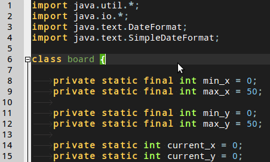

# geany-dark-scheme


This is a dark syntax colouring theme for the [Geany](http://www.geany.org/) text editor.



Please help us extend the geany-dark theme to support new languages! Please extend the current theme by using the colours from one of the existing syntax files - that way they all play nice together.

## Language Support

The scheme currently supports highlighting for these languages:

- .c - C languages files (contributed by Paulo Cabido)
- .cs - C# language files (contributed by Duncan Lock)
- .cpp - C++ (contributed by gtk.monkey)
- .conf - Apache (and Geany) style .conf files (contributed by Duncan Lock)
- .css - Cascading Stylesheet files (contributed by Roman Snitko)
- .d - d language files (contributed by gtk.monkey)
- .docbook - Docbook mark-up files (contributed by gmunkhbaatarmn)
- .haskel - Haskel code (contributed by Dave.Sarman)
- .html - Hypertext Markup Language file - web pages (contributed by Roman Snitko, Javascript support added by Daniel Mlodecki)
- .java - Java language files (contributed by Paulo Cabido)
- .javascript - Javascript scripts (Duncan Lock, partially based on GeanyDarkTango?)
- .latex - Latex files (contributed by Enrico Tröger)
- .lua - Lua script files (contributed by curtstrangward)
- .markdown - Markdown text files (contributed by pho3nixf1re84)
- .NSIS - Nullsoft Scriptable Installer System scripts (contributed by mr.soup12, modified by Duncan Lock)
- .pascal - Pascal code (contributed by gtk.monkey)
- .perl - Perl language files (contributed by Roman Snitko)
- .php (contributed by Roman Snitko, improved by s5n43K3s)
- .py - Python language files (contributed by Nicolas Hainaux)
- .r - R stats language (contributed by weibullguy)
- .rb - Ruby language files (contributed by Roman Snitko)
- .sh - Bash shell scripts (contributed by Duncan Lock)
- .sql - SQL database query files (contributed by Duncan Lock)
- .yaml - YAML files (contributed by pho3nixf1re84)
- .vala - Vala language files (contributed by boromil)
- .xml - Extensible Markup Language files (contributed by Roman Snitko)

## How to Install the Theme

### Linux: (Ubuntu)

#### Local User (just for you):

The simplest way to do this is to copy the contents of the filedefs folder into the `~/.config/geany/filedefs/` folder. This means that you can only have one theme installed at a time, though.

A better way, is to copy the contents filedefs folder into a `~/.config/geany/geany_dark_filedefs/` folder, creating the folder if it doesn't already exist. Then create a symlink to that folder:

```bash
ln -s ~/.config/geany/geany_dark_filedefs/ ~/.config/geany/filedefs
```

This allows you to have several themes stored in your `~/.config/geany/` folder, and to change which one you're using by changing where the `~/.config/geany/filedefs` symlink points.

#### System Wide:

**BE SURE TO BACK UP THE EXISTING FILEDEFS IF YOU DON'T WANT TO LOSE THEM!**

Copy the filedefs folder into `/usr/share/geany/`

**NOTE**: Geany may be installed in `/usr/local/geany/` or `/opt/geany/` depending on your OS or your installation method. Be sure to choose the correct directory. This method means that your filedef files will get overwritten when you upgrade Geany and also means that you can only have one theme installed at a time.

### Windows:
Copy the contents of the `filedefs` folder to...

**Current User only:**

`%APPDATA%\geany\filedefs`

**System Wide:**

**BE SURE TO BACK UP THE EXISTING FILEDEFS IF YOU DON'T WANT TO LOSE THEM!**

`C:\Program Files\Geany\data`

NOTE: This method means that your filedef files will get overwritten when you upgrade Geany and also means that you can only have one theme installed at a time.
